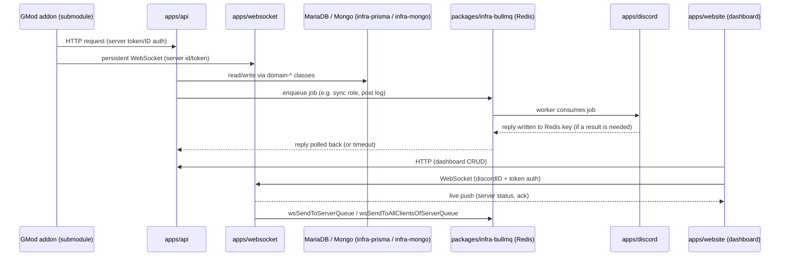

# Architecture

## Overview

This repository is a **Turbo + Bun monorepo**. It is the backend + frontend for "Gmod Integration": a product
that connects a Garry's Mod dedicated server to Discord (player verification, role/nickname sync, chat relay,
server status, RCON from Discord, moderation, statistics, ...).

Two things live outside plain "web app" territory and shape most of the design decisions below:

- The actual game server integration is a **Lua addon** running inside Garry's Mod, versioned as a separate
  git submodule ([`submodules/gmod-integration`](../submodules/gmod-integration), see
  [docs/submodules/gmod-integration.md](./submodules/gmod-integration.md)). It is the client of everything in
  this monorepo.
- The Discord bot needs a single, persistent `discord.js` gateway connection — you cannot have multiple
  processes logging in with the same bot token without fighting over the gateway. That constraint drives the
  app split and the BullMQ bridge described below.

## Why this shape

### Why separate `apps/api`, `apps/discord`, `apps/websocket`?

Each has a different runtime profile:
- `api` is stateless HTTP — trivially horizontally scaled (target `2/2` replicas in prod, see
  [deployment/swarm.md](./deployment/swarm.md)).
- `discord` holds the one live `discord.js` client (main bot) plus per-guild custom bot clients — it is not
  stateless and cannot be scaled the same naive way.
- `websocket` holds long-lived socket state per connected GMod server / dashboard client, in memory, per
  process.

Splitting them means a crash or redeploy of one doesn't take the others down, and each can be scaled/tuned for
its own workload independently.

### Why go through BullMQ instead of calling Discord directly from `api`?

Only `apps/discord` is logged into Discord. If `api` (or `core`/`domain-*`) needs a Discord-side effect —
create a channel, fetch a Discord user, sync a role, upload a screenshot to a channel — it cannot just import
`discord.js` and act; there is no live client there, and logging in a second client with the same token causes
gateway conflicts. So instead:

1. The caller enqueues a job on a BullMQ queue (`packages/infra-bullmq`).
2. `apps/discord`'s worker consumes it and executes the action with the live client.
3. If the caller needs a result, it's written to a Redis key `bullmq:reply:<correlationId>` and the caller
   polls for it (with a timeout — `BullMQReplyTimeoutError`).

This keeps the Discord client as the single owner of the Discord connection while letting every other app
trigger Discord-side effects without a heavier synchronous RPC framework.

### Why `websocket` as its own app instead of Socket.IO bolted onto `api`?

GMod servers keep a persistent WebSocket open to receive push messages (config changes, live status) and to
push events up without polling. Because `websocket` can run multiple replicas, a message addressed to a given
server might need to be delivered by a *different* replica than the one that owns that server's socket — that's
why `wsSendToServerQueue` messages that aren't found locally are re-broadcast over a Redis pub/sub channel with
a short-lived ack key, instead of assuming the local process has the connection.

### Why both MariaDB (Prisma) and MongoDB?

MariaDB via Prisma (`packages/infra-prisma`) is the relational source of truth: servers, guilds, users, bans,
warns, config. MongoDB (`packages/infra-mongo`) holds high-volume, loosely structured data that would bloat a
relational table — primarily `gm_server_logs` (in-game chat/kill/event logs).

### Why is the Redis role split into cache / pub-sub / BullMQ backing store?

It's one Redis instance doing three jobs: BullMQ's own queue storage, short-TTL caching of hot lookups (e.g.
guild locale, Discord guild snapshots), and pub/sub for cross-replica WebSocket delivery. There's no dedicated
message broker beyond Redis — it was judged not worth the operational cost for this scale.

### Why is the GMod addon a separate submodule, not part of this workspace?

It's a different language/runtime (GLua, not Node/TypeScript) with its own release pipeline: GMA packaging for
Steam Workshop, its own auto-release GitHub Action, its own AGENTS.md and lint conventions (realm prefixes
`sv_`/`cl_`/`sh_`, no stock-Lua formatter). Bundling it into the Bun/Turbo workspace would gain nothing and
risk tooling collisions.

## Repo map

```text
apps/
  api        -> HTTP API (Express). Entry point for the GMod addon, the website, and webhooks.
  discord    -> Discord bot(s) (main + per-guild custom) + BullMQ workers that execute Discord actions.
  websocket  -> WebSocket gateway: live connections to GMod servers and dashboard clients.
  website    -> Frontend (React/Vite): public site + dashboard.
  docs       -> Docusaurus site that publishes the PUBLIC product documentation (not this ./docs folder).

packages/
  config       -> env loading + Zod validation, single source of truth for config.
  schema       -> Zod contracts (BullMQ payloads, GMod entities, DB-facing shapes).
  core         -> cross-cutting application logic: v3 API models, DB helpers, logging/localization/format utils,
                  shared Express request types.
  domain-*     -> domain-oriented business logic (server, guild, user, moderation, compliance, gmod entities).
  infra-*      -> technical adapters (Prisma/MariaDB, Mongo, Redis, BullMQ, MinIO/S3, Steam API, WS queues).
  locales      -> raw translation JSON, consumed by core's localization utils and the website.

submodules/
  gmod-integration -> the Garry's Mod Lua addon. Separate repo, separate toolchain, separate release pipeline.
```

Per-folder detail: see [docs/README.md](./README.md) for the full docmap with a link to a dedicated page for
every app and package.

## End-to-end data flow



In words:

1. The GMod addon (submodule) authenticates to `api` with a server token/ID, and opens a WebSocket to
   `websocket` with the same credentials.
2. In-game events reach `api` (HTTP) or `websocket` (socket messages), and are persisted through
   `domain-*` classes into MariaDB (Prisma) and/or MongoDB (server logs).
3. Anything that needs a Discord-side effect is enqueued as a BullMQ job; `apps/discord`'s worker executes it
   with the live `discord.js` client and, if a result is expected, writes it back to Redis for the caller to
   pick up.
4. The dashboard (`apps/website`) talks to `api` for CRUD and opens its own WebSocket (authenticated by
   `discordID` + token) to receive live pushes — e.g. server online/offline status.

## Allowed dependencies

General rule: only "downward" dependencies.

- `apps/*` can depend on `packages/*`.
- `core` can depend on `domain-*`, `infra-*`, `config`, and `schema`.
- `domain-*` can depend on `infra-*`, `config`, and `schema`.
- `infra-*` must not depend on `apps/*`.
- `schema` should only depend on validation libraries (`zod`).

## Critical boundaries

### Discord boundary

- Any Discord action triggered outside `apps/discord` must go through BullMQ.
- Use `@gmod/infra-bullmq/discordQueueAdapters.js`.
- Define/update payloads in `packages/schema/src/bullmq.ts`.
- Implement worker handlers in `apps/discord/src/discord/workers/discordQueueWorkers.ts`.

### Config boundary

- Single source of truth: `@gmod/config`.
- `@gmod/config` loads workspace `.env` files and validates with Zod.
- Avoid reading `process.env` directly in business modules.

### Data boundary

- Prisma client is generated in `packages/infra-prisma/generated/prisma`.
- Import Prisma client through `@gmod/infra-prisma`.
- Do not duplicate Prisma clients in apps.

## Composition patterns

### API endpoint pattern

1. Route (`apps/api/src/routes/*`)
2. Validation/Auth middleware (`apps/api/src/middleware/*`)
3. Thin controller (`apps/api/src/controllers/*`)
4. Extracted logic in `packages/core/src/models/*` or `packages/domain-*`

### WebSocket pattern

- Asynchronous sending through BullMQ queues (`@gmod/infra-websocket/queues.js`).
- Processing in the websocket app via workers, with a Redis pub/sub fallback for cross-replica delivery.

### Global Express typing

- `Request` extensions (`req.server`, `req.panelUser`, etc.) are centralized in:
  - `packages/core/src/types/express.d.ts`

## Anti-patterns to avoid

- Importing `apps/discord/...` from API/core/domain.
- Heavy business logic in controllers/routes.
- Duplicating payload schemas outside `packages/schema`.
- Introducing new cycles between domain packages.
- Adding Lua/GMod-addon changes to this workspace instead of the `submodules/gmod-integration` submodule.
