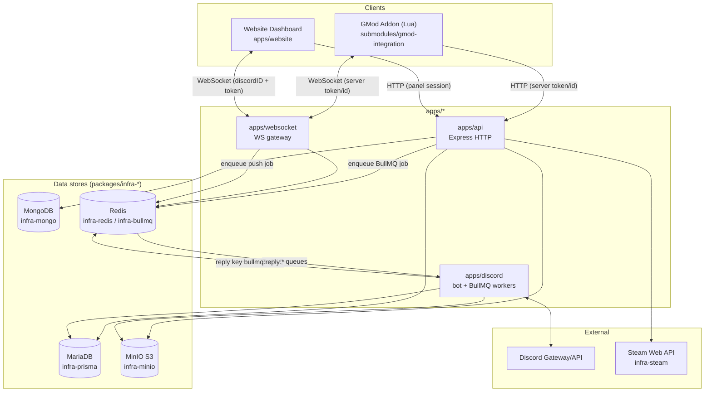
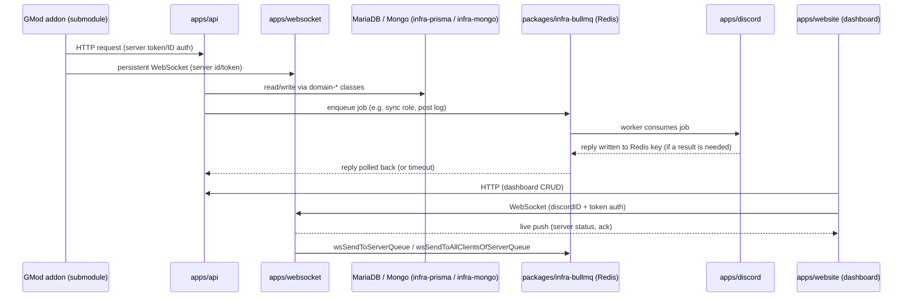
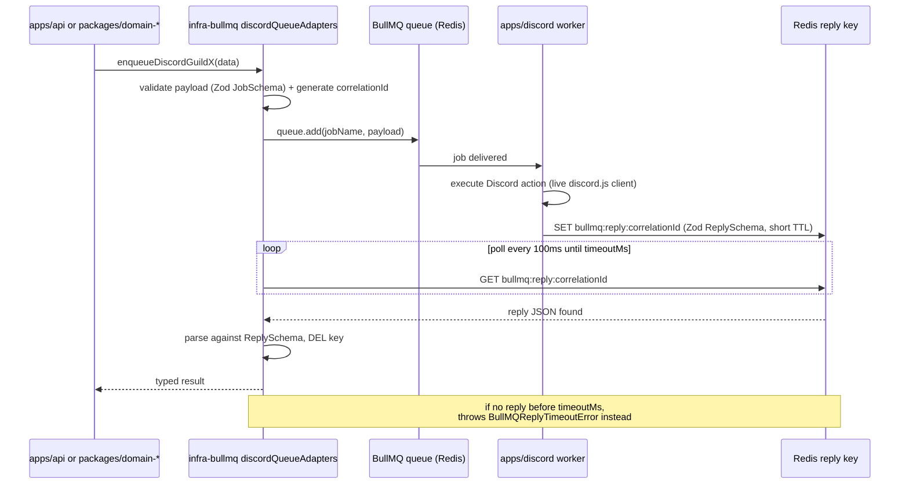
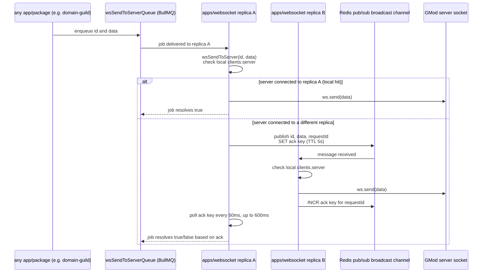
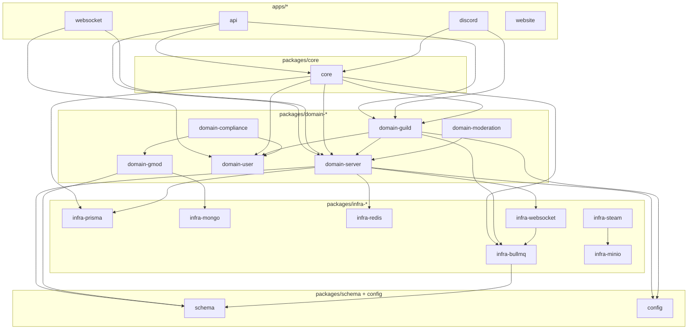
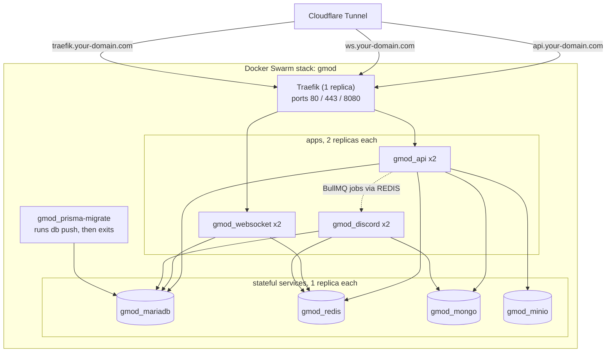

# Architecture Diagrams

Visual companions to [docs/architecture.md](../architecture.md). Each diagram has a `.mmd` source file in
this folder (Mermaid syntax — open it directly in the
[Mermaid Live Editor](https://mermaid.live), a Mermaid-aware IDE plugin, or any tool that renders `.mmd`) and
is also embedded below in a fenced code block so it renders inline on GitHub/GitLab and in this doc viewer.

If you change something these diagrams describe (a queue, a boundary, a deployment topology), update the
`.mmd` file **and** the copy embedded below — they must stay identical, keep them in sync in the same commit.

## 1. System overview

Source: [`system-overview.mmd`](./system-overview.mmd)

What talks to what: the GMod addon and the dashboard as clients, the three runtime apps, the data stores each
one owns, and the external services (Discord, Steam).

## 2. End-to-end request flow

Source: [`request-flow.mmd`](./request-flow.mmd)

A single in-game event and a single dashboard action, from client to Discord and back.

## 3. Discord/BullMQ request-reply bridge

Source: [`discord-bullmq-bridge.mmd`](./discord-bullmq-bridge.mmd)

The mechanism behind every `enqueueDiscordX(...)` call in
[`@gmod/infra-bullmq`](../packages/infra-bullmq.md) — how a caller that isn't `apps/discord` gets a typed
result back from an action that only the live Discord client can perform.

## 4. WebSocket cross-replica delivery

Source: [`websocket-delivery.mmd`](./websocket-delivery.mmd)

Why a message addressed to a GMod server doesn't get lost when `apps/websocket` runs multiple replicas and
that server's socket lives on a different replica than the one that received the job.

## 5. Package dependency layers

Source: [`package-dependency-layers.mmd`](./package-dependency-layers.mmd)

The allowed-dependency rule from
[architecture.md — Allowed dependencies](../architecture.md#allowed-dependencies), drawn as edges — every
arrow points "downward". An edge going the other way (e.g. an `infra-*` package importing `domain-*`, or
`packages/*` importing `apps/*`) is the anti-pattern to catch in review.

This is a representative subset (the busiest packages), not exhaustive — see each package's own doc under
[docs/packages/](../packages) for its full dependency list.

## 6. Production deployment topology

Source: [`deployment-topology.mmd`](./deployment-topology.mmd)

Matches `docker-stack.swarm.yml` and [docs/deployment/swarm.md](../deployment/swarm.md): replica counts,
Traefik routing, and which services touch which datastore.

